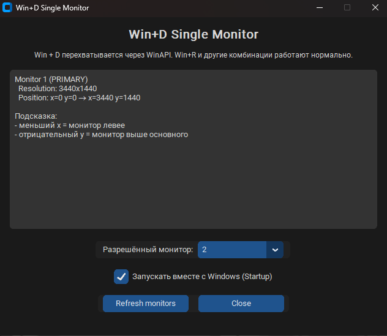

# Win+D Single Monitor

I use two monitors every day and one thing always annoyed me:

When you press **Win + D**, Windows minimizes windows on **all monitors**.

Sometimes I only want to clear the monitor I'm currently working on while keeping everything open on the second screen.

So I built this small utility.

It intercepts **Win + D** and applies "Show Desktop" only to the monitor where your cursor is currently located.

  

## Features

- Per-monitor Show Desktop
- Works with multiple monitors
- Keeps normal Windows shortcuts working (Win+R, Win+E, Win+L, etc.)
- Autostart support
- Lightweight and runs in the background

## Why?

Because Windows still doesn't provide a built-in way to use Show Desktop on a single monitor.

## Installation

1. Download the latest release
2. Run `WinDSingleMonitor.exe`
3. Choose the monitor you want to control

## Built With

- Python
- pywin32
- CustomTkinter
- pystray
- Pillow